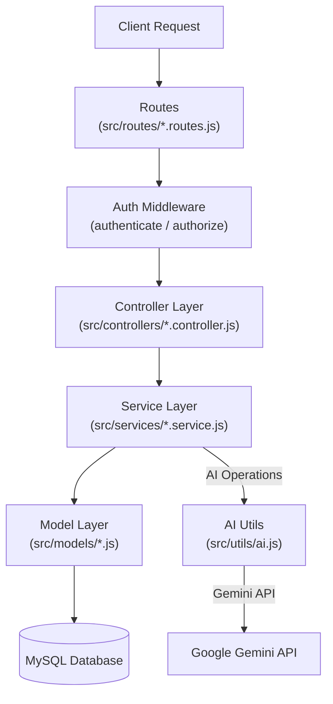
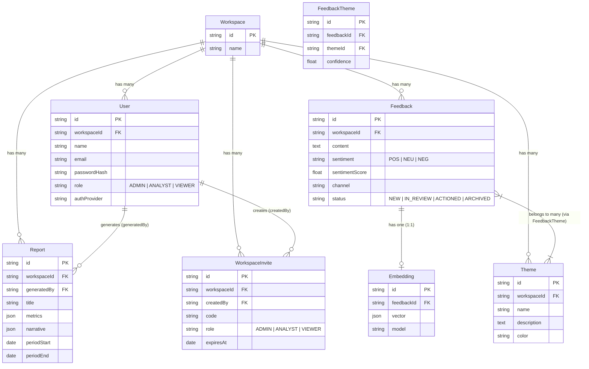

# Backend Architecture Deep-Dive

This document details the backend architecture for LOOP, including layer responsibilities, AI feature pipelines, database entity-relationship models, and workspace multi-tenant isolation mechanisms.

---

## Layered Architecture & Request Flow

---

## Layer Responsibilities

- **Routes (`src/routes/`)**: Map HTTP methods and URL paths to controllers and attach authentication (`authenticate`) and role-gating (`authorize`) middleware.
- **Middleware (`src/middleware/`)**: Verify session JWTs, attach the authenticated user object (`req.user`) to the request, and enforce role permissions (`ADMIN`, `ANALYST`, `VIEWER`).
- **Controllers (`src/controllers/`)**: Thin HTTP handlers. Responsible only for validating request inputs, formatting responses, returning HTTP status codes, and delegating core logic to services.
- **Services (`src/services/`)**: Contain all application business logic, multi-tenant database operations, transaction handling, and external AI integrations. Services are modular and reused across controllers and CLI seeder scripts.
- **Models (`src/models/`)**: Pure Sequelize schemas defining database column types, constraints, hooks, and model associations (`src/models/index.js`).
- **Utils & Lib (`src/utils/`, `src/lib/`)**: Helper modules for JWT tokens, theme keyword matchers, AI provider integration (`utils/ai.js`), and Zod validation schemas.

---

## AI Feature Pipelines

LOOP includes three core AI feature pipelines powered by Google Gemini and vector embeddings:

### 1. Ingestion & Classification Pipeline

1. **Trigger**: Feedback enters via single entry (`ingestSingle`), CSV upload (`ingestCSV`), or simulated integrations (`ingestChannel`).
2. **Override Evaluation**: `classification.service.js` checks if the caller explicitly provided manual sentiment, sentiment score, or theme name overrides.
3. **AI / Fallback Classification**: If classification is required, `utils/ai.js` sends text to Gemini (`gemini-3.5-flash-lite`). If `GEMINI_API_KEY` is missing or fails, it falls back gracefully to `utils/themeMatcher.js` keyword analysis.
4. **Persistence**: Feedback records and associated themes (`FeedbackTheme` join entries with confidence scores) are stored in MySQL within the workspace boundary.

### 2. Ask LOOP / RAG (Retrieval-Augmented Generation) Pipeline

1. **Vector Storage**: During feedback ingestion, `embedding.service.js` calls Gemini (`gemini-embedding-001`) to generate a vector embedding stored in the `Embedding` table.
2. **Query Processing**: `ask.controller.js` receives a natural language question. `ask.service.js` first checks if the input is a greeting/meta-question (calling `chatConversational`).
3. **Vector Retrieval**: For analytical queries, `retrieval.service.js` generates an embedding for the user's question and executes a cosine similarity search across the tenant's stored embeddings (`topK: 5`, `minSimilarity: 0.35`).
4. **Grounded Generation**: `askGrounded()` constructs a prompt containing retrieved feedback items. Gemini generates an answer alongside citation IDs.
5. **Citation Validation**: `ask.service.js` validates that returned citation IDs strictly belong to the retrieved set before sending the grounded response and sources back to the client.

### 3. Voice-of-Customer (VoC) Report Pipeline

1. **Statistical Aggregation**: `report.service.js` computes statistical metrics in pure JavaScript/SQL queries (total feedback count, sentiment distribution percentages, top recurring themes, volume trends).
2. **AI Narrative Generation**: `reportNarrative.service.js` sends *only* aggregated numerical stats and theme summaries to Gemini (`gemini-3.5-flash-lite`), preventing raw PII data exposure while generating executive summaries, key findings, and action items.
3. **Storage & PDF Export**: Saved to the `Report` table. The user can view the report online or export a formatted PDF generated dynamically via `pdfkit` in `pdf.service.js`.

---

## Database ER Diagram (Sequelize Models)

---

## Multi-Tenant Isolation Enforcement

Multi-tenant isolation is guaranteed by two mandatory coding standards:

1. **Authentication Session Binding**: `auth.middleware.js` verifies the JWT token on every protected route, fetches the user record from the database, and attaches `req.user = { id, workspaceId, role, ... }` to the request object.
2. **Explicit Parameter Passing**: Controllers never extract `workspaceId` from `req.body` or `req.params`. Service functions explicitly require `workspaceId` as a parameter (e.g., `getFeedbacks(workspaceId, filters)`). Every Sequelize query includes `where: { workspaceId }` to ensure complete tenant isolation.
