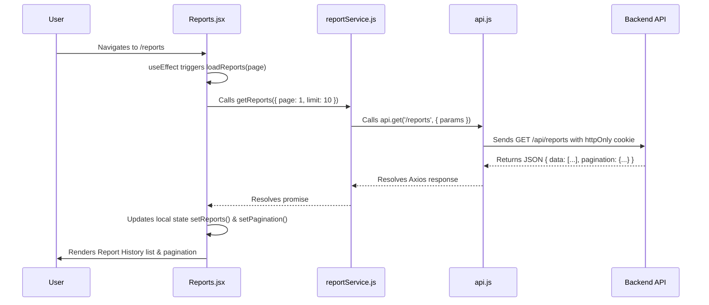

# Frontend Architecture Deep-Dive

This document details the frontend architecture for LOOP, including routing mechanisms, component organization, state management boundaries, and data-fetching patterns.

---

## Component Architecture & Data Flow

```mermaid
graph TD
    Pages["Page Views<br>(src/pages/*)"]
    Components["Shared Components<br>(src/components/*)"]
    Services["API Services<br>(src/services/*)"]
    ReduxStore["Redux Store<br>(src/store/slices/*)"]
    ThemeContext["Theme Context<br>(src/context/ThemeContext.jsx)"]
    BackendAPI["Backend REST API"]

    Pages -->|Renders| Components
    Pages -->|Dispatches Thunks| ReduxStore
    Pages -->|Consumes Theme| ThemeContext
    ReduxStore -->|HTTP Requests| Services
    Pages -->|Direct Service Calls| Services
    Services -->|Axios Instance (api.js)| BackendAPI
```

---

## Routing & Route Guards

Routing is configured in `src/App.jsx` using React Router v7 and lazy-loaded components (`React.lazy` & `Suspense`).

### Route Types:

1. **Public / Landing (`RootRoute`)**: Renders `<Landing />` for unauthenticated visitors, or automatically redirects authenticated users to `/dashboard`.
2. **Guest-Only Routes (`GuestRoute`)**: Protects `/login` and `/signup`. Authenticated users attempting to access these routes are redirected to `/dashboard`.
3. **Authenticated Base Routes (`ProtectedRoute`)**: Wraps protected layout pages (`/dashboard`, `/trends`, `/feedback`, `/ask`, `/reports`, `/reports/:id`). Ensures session hydration via `fetchMe` and renders `<Layout>` navigation wrappers.
4. **Role-Gated Routes (`ProtectedRoute allowedRoles={[...]}`)**:
   - `/ingestion`: Gated to `ADMIN` and `ANALYST` roles.
   - `/settings/workspace`: Gated exclusively to `ADMIN` role.
   - Users attempting unauthorized role access are redirected to `/unauthorized`.

---

## State Management Boundaries

LOOP clearly divides state across Redux Toolkit, React Context, and Local State:

| Layer | Responsibility | Managed Files | Rationale |
| :--- | :--- | :--- | :--- |
| **Redux Toolkit** | Application Domain State | `store/slices/authSlice.js`<br>`store/slices/workspaceSlice.js` | Global session status (`user`, `loading`), workspace metadata, member lists, and active invite codes needed across layout, settings, and navigation components. |
| **React Context** | UI Preference State | `context/ThemeContext.jsx` | Manages theme mode (`light`, `dark`, `system`), resolves system color scheme preferences, and synchronizes document root attributes (`data-theme`, `data-bs-theme`). |
| **Local State (`useState`)** | View & Form State | Page & Component files | Used for page-isolated UI inputs, active filter dropdowns, table pagination indices, chart view toggles, and modal visibility states. |

---

## Component Conventions

- **Colocated Styles**: Every page and component directory contains its `.jsx` logic file and `.css` stylesheet (e.g., `src/pages/Dashboard/Dashboard.jsx` imports `./Dashboard.css`).
- **Shared Common UI (`src/components/common/`)**: Provides uniform UI states:
  - `PageHeader`: Standardized page title and subtitle header banner.
  - `ErrorState`: Friendly error alerts with retry handlers.
  - `EmptyState`: Empty dataset illustrations and call-to-actions.
  - `StatusBadge`: Colored status indicators for feedback processing states.
- **Shared Charts (`src/components/charts/`)**: Reusable Recharts wrappers (`FeedbackVolumeChart`, `SentimentBreakdownChart`, `TopThemesChart`) accepting data props for rendering high-density analytics.

---

## Data-Fetching Walkthrough: Voice-of-Customer Reports

Here is a step-by-step trace of how `Reports.jsx` fetches and manages report data:



1. **Service Layer**: `src/services/reportService.js` wraps backend API routes using the centralized Axios instance (`api.js`), which includes `withCredentials: true` to automatically transmit the `httpOnly` session cookie.
2. **Page Execution**: `Reports.jsx` invokes `getReports({ page, limit: 10 })` inside a `useCallback` hook when the page loads or pagination changes.
3. **Local State Handling**: The returned data updates `reports` state array and `pagination` metadata object, transitioning `listLoading` from `true` to `false` and rendering either `<EmptyState />` or the report history list.
