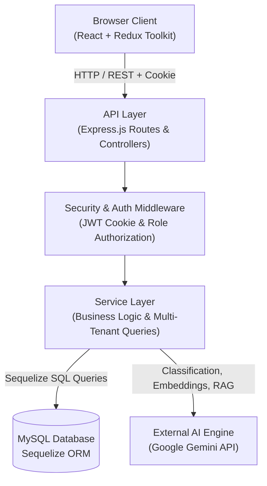

# Architecture Overview

This document provides a high-level overview of the LOOP system architecture, component topology, request lifecycle, and multi-tenant isolation model.

---

## High-Level System Topology

---

## Request Lifecycle

1. **Authentication Check**: Incoming HTTP requests carry an `httpOnly` JWT session cookie. The `authenticate` middleware verifies the token signature and populates `req.user` with user identity and tenant scope (`workspaceId`).
2. **Role Authorization**: The `authorize` middleware checks whether `req.user.role` matches the route requirements (`ADMIN`, `ANALYST`, or `VIEWER`).
3. **Workspace-Scoped Processing**: Controllers delegate to services, passing `req.user.workspaceId` explicitly to enforce multi-tenant boundary checks on all database operations.
4. **AI & Response Execution**: For AI features, services construct structured context, interact with Google Gemini or retrieve local vector embeddings, save results to MySQL, and return a clean JSON payload to the client.

---

## Multi-Tenancy & Tenant Isolation

Multi-tenancy in LOOP is enforced strictly at the database and service layer. Every tenant-owned database table (`User`, `Feedback`, `Theme`, `Report`, `WorkspaceInvite`) includes an indexed `workspaceId` foreign key. All database reads and writes execute queries scoped by `workspaceId`. Crucially, `workspaceId` is extracted exclusively from the authenticated JWT session (`req.user.workspaceId`) on the server side and is never trusted or accepted from user-supplied request bodies or URL path parameters for multi-tenant data operations.

---

## Further Architectural Deep Dives

- [Backend Architecture Deep-Dive](architecture-backend.md) — Layer responsibilities, AI feature pipelines, database ER diagrams, and isolation enforcement.
- [Frontend Architecture Deep-Dive](architecture-frontend.md) — Route protection, state management boundaries, component structure, and data flow walkthroughs.
